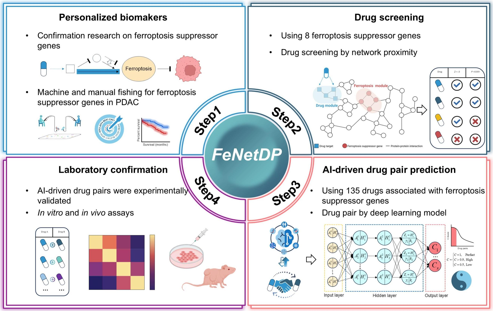

# Code for FeNetDP
These files are the key script for the FeNetDP

FeNetDP: Network-informed discovery of ferroptosis-targeting drug combinations in pancreatic ductal adenocarcinoma

Saisai Tian, Xuyang Liao, Jiahan Le, Xinyi Wu, Huihui Chen, Jinyuan Lu, Qiao Liu, Jiangjiang Qin, Weidong Zhang

The current repository contains the source code for identifying ferroptosis-related genes, followed by feature screening and prioritization, and ultimately for generating the ranking of drug combinations in PDAC.

  

# Installation

The code has been tested with Python 3.9 and R 4.4.1 on Ubuntu 22.4 and includes libraries such as torch, torch_geometric, numpy, networkx, scikit-learn, among others.

    pip install -r requirements.txt 

It typically takes a few minutes.

You also need to download some large files and put them in data folder:

Gene expression profiling of patients:

    https://linkedomics.org/data_download/CPTAC-PDAC/

PPI networks:

    https://string-db.org/cgi/download.pl

# Analysis Workflow

This study employs a stepwise computational pipeline integrating survival analysis, robustness validation, network-based modeling, and AI-driven drug combination prediction.

    cd code/

## 1. Cox Regression Analysis

Univariate Cox regression was first performed to identify prognosis-associated genes from patient cohorts.

    Rscript Cox.R

## 2. Bootstrap Validation

Bootstrap resampling was conducted to assess the stability and robustness of the selected features.

    Rscript Bootstrap.R

## 3. Random Survival Forest (RSF)

To further refine and prioritize prognostic features, a Random Survival Forest (RSF) model was applied.

    Rscript RSF.R

## 4. Network Proximity Analysis

A network-based approach was used to quantify the proximity between drug targets and disease-associated genes within the protein–protein interaction (PPI) network.

    python PDAC_network_proximity.py

## 5. AI-based Drug Combination Prediction

A network-based approach was used to quantify the proximity between drug targets and disease-associated genes within the protein–protein interaction (PPI) network.

    cd AI-drug-pair
    python workfolw.py

Please note that the code is also compatible with the CUDA version. 

